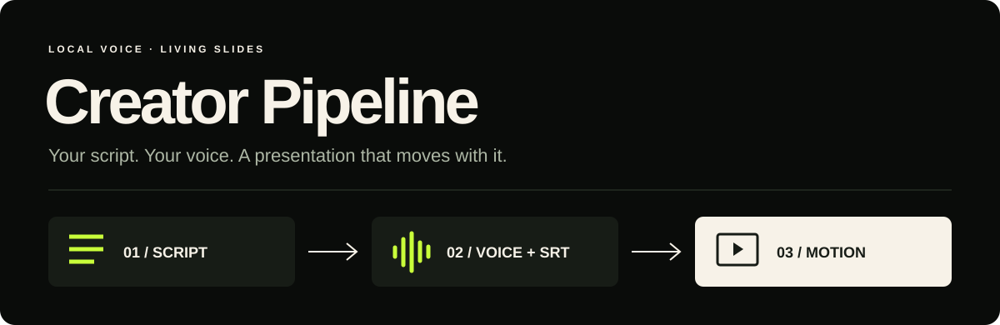
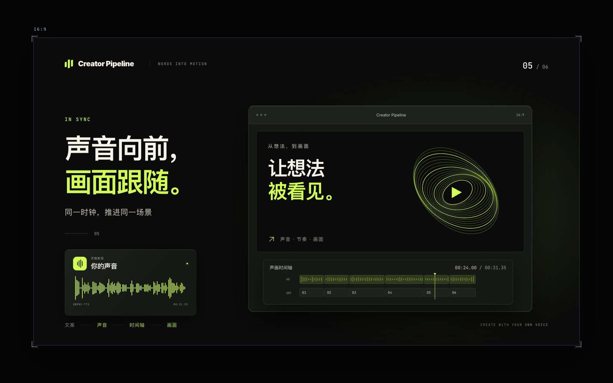

<p align="center"></p>

<p align="center"><b>Your script. Your voice. A presentation that moves with it.</b><br>
<a href="README.md">中文</a> · English</p>

<p align="center"><a href="https://nanmicoder.github.io/creator-pipeline/"><b>▶ Watch the live demo</b></a> · <a href="https://nanmicoder.github.io/creator-pipeline/?review=1&amp;t=0&amp;steps=1">Explore all 21 action beats</a></p>

No installation needed: click to play **25 seconds of MiniMax cloned narration, a real SRT timeline and continuous 16:9 animation**. The creator has authorized the sample narration for this public demo. GitHub Pages is the primary preview; a [Vercel backup](https://creator-pipeline-alpha.vercel.app/) is also available.

The complete demo source and published narration are versioned in [examples/live-demo](examples/live-demo/README.md). To edit or present it locally, use Node.js 22 LTS:

```bash
cd examples/live-demo/presentation
npm ci
npm run dev
```

No TTS account is needed to run the bundled demo. Editing the source requires a new build and deployment. See the [demo maintenance guide](examples/live-demo/README.md) for the GitHub Pages and Vercel publishing setup.

Creator Pipeline combines two AI Agent skills: clone narration from your own reference recording, produce audio and an SRT timeline, then build an autoplaying web presentation with continuous diagrams, cards and motion graphics.

The default is **MiniMax speech-2.8-hd**, using your own registered voice and speech-capable account. For free local inference, explicitly choose `--provider local`: Qwen3-TTS via MLX on Apple Silicon or official PyTorch elsewhere. Installing the skills installs instructions, scripts and templates; model weights download when you first use the local voice backend.

## Install

```bash
npx skills add NanmiCoder/creator-pipeline \
  --skill voice-clone-tts \
  --skill web-video-presentation
```

Uses the [Vercel skills CLI](https://github.com/vercel-labs/skills) and its standard `skills/<name>/SKILL.md` layout. Codex and Claude Code project-level copy installations have been tested.

## Try it

Prepare a script and a clean 10–30 second recording (MiniMax accepts 10–300 seconds; local models usually use 3–30 seconds) of your own or an authorized voice. Ask your Agent:

> Use voice-clone-tts and web-video-presentation. Read script.md and use my-voice.mp3 as the voice reference. Use my MiniMax voice, or register my reference recording with MiniMax first. Start with a narration sample and check pronunciation and voice similarity, then generate the full WAV, MP3 and SRT. Build a 16:9 autoplaying web presentation from the final timeline, using continuous diagrams and purposeful motion instead of dense text. Run the checks and play it in a real browser before handing it over.

Voice generation requires Python 3.12, uv and FFmpeg. The skill's setup script creates a separate environment for each backend. The web presentation requires Node.js/npm. See [setup](skills/voice-clone-tts/references/SETUP.md) and the runnable [first-video example](examples/first-video/README.md). Production instructions and the sample currently focus on Chinese narration.

| Skill | Produces |
|---|---|
| [voice-clone-tts](skills/voice-clone-tts/SKILL.md) | WAV, MP3, SRT and a verified `voiceover.json` handoff |
| [web-video-presentation](skills/web-video-presentation/SKILL.md) | A Vite + React + TypeScript presentation, driven by the final audio clock |

<a href="https://nanmicoder.github.io/creator-pipeline/"></a>

The example contains **21 editorial action beats within six original SRT cues**, with forward, back and replay controls. See the [runnable example](examples/first-video/README.md) and [same-audio comparison](docs/VALIDATION.md).

SRT timing comes from actual PCM sample frames for each synthesized segment. It is segment-level timing, not word-level forced alignment. Structural checks cannot prove correct pronunciation or voice similarity.

The output is an **HTML presentation, not a `.pptx` file**. MP4 output requires the separate [recording workflow](skills/web-video-presentation/references/RECORDING.md).

Preview, autoplay and frame review keep the same framed **16:9 capture area**, with guides outside the content. Browser QA uses the user's chosen or locally available browser skill—Ego, agent-browser or another real browser tool. No specific browser product is required.

## Backends and evidence

- **MLX, local option:** Qwen3-TTS 0.6B Base 4bit on Apple Silicon. Tested on the same six-sentence script.
- **Qwen PyTorch, local option:** official Base model adapter supplied; CUDA hardware execution has not been tested.
- **Nano, explicit option:** MOSS-TTS-Nano 100M ONNX on CPU. Tested on Apple Silicon macOS, including actual synthesis, interruption recovery and audio-to-web handoff. The full Python entry point still uses PyTorch for audio preprocessing.
- **MiniMax, default:** live voice registration and two rounds of three matching scripts tested. The voice owner preferred MiniMax on all three listening cases. Speaker encoders gave close scores for MiniMax and Qwen; this does not establish universal superiority. Cloud usage may incur charges.

One Nano first pass produced ASR discrepancies. Targeted seed overrides allow retrying only an affected sentence while keeping the other cached segments. We keep these failures in the evaluation rather than claiming perfect audio from a valid WAV file.

See [validation](docs/VALIDATION.md), [backend selection](docs/TTS-BACKENDS.md) and [third-party notices](THIRD_PARTY_NOTICES.md) for measured results, pinned versions, licenses and limitations. Initial downloads, disk space and RAM are still required. The single-listener preference and speaker-embedding comparison are not a controlled double-blind study or a cross-device speed guarantee.

## Development

```bash
python3 -m unittest discover -s tests -v
python3 scripts/check-package.py
```

Please include reproducible, sanitized examples when reporting bugs. Keep API keys, private voice recordings and model weights out of the repository.

MIT licensed. The web skill builds on [ConardLi/garden-skills](https://github.com/ConardLi/garden-skills), with its license retained. OpenMOSS, Qwen, MLX Audio and other upstream projects retain their respective code and model licenses.
